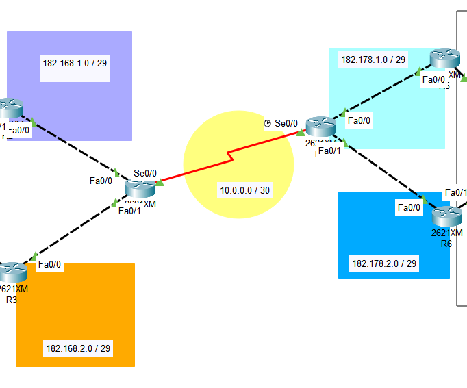
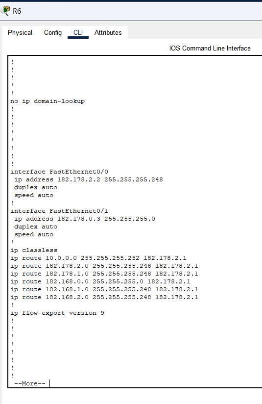

# Manual técnico
## Introducción
Después de realizar un buen trabajo para la empresa “Solución al Cliente S.A.”, el camino
de la vida lo guía hacia una nueva contratación, esta vez por la administración del Colegio
CiscoWorks, quienes desean expandir su oferta educativa y como resultado fue creada la
Academia Técnica de Formación Empresarial – ACATEC.

## Topología de red
### RED1

### RED2

### Conexion Estatica

## Configuración Routers
## Router1

### Comandos utilizados
- enable
- configure terminal
- no ip domain-lookup
- hostname R1
- int se0/0
- ip add 10.0.0.1 255.255.255.252
- no shutdown
- int f0/0
- ip add 182.168.1.2 255.255.255.248
- no shutdown
- int f0/1
- ip add 182.168.2.2 255.255.255.248
- no shutdown

## Router2

### Comandos utilizados
- configure terminal
- no ip domain-lookup
- hostname R2
- interface f0/1
- ip add 182.168.0.2 255.255.255.0
- standby 10 ip 182.168.0.1
- standby 10 priority 150
- standby 10 preempt
- no shutdown
- interface f0/0
- ip add 182.168.1.1 255.255.255.248
- no shutdown

## Router6

### Comandos utilizados
- configure terminal
- no ip domain-lookup
- hostname R6
- int f0/1
- ip add 182.178.0.3 255.255.255.0
- no shutdown
- int f0/0
- ip add 182.178.2.2 255.255.255.248
- no shutdown

Para verificar la configuración de los Routers  deberá ingresar el siguiente comando:
- show running-config

## Configuración Switches
## Switch1

### Comandos utilizados
- configure terminal
- interface range fa0/3-4
- channel-group 1 mode desirable
- exit
- interface port-channel 1 
- switchport mode trunk
- end
- wr

## Switch2

### Comandos utilizados
- configure terminal
- interface range fa0/3-4
- channel-group 1 mode desirable
- exit
- interface port-channel 1 
- switchport mode trunk
- end
- wr

Para verificar la configuración de los Routers  deberá ingresar el siguiente comando:
- show running-config

## VPCS
## VPC11

## VPC14

## Resumen Comandos Usados
## Rutas estaticas 

### Comandos utilizados
- conf t
- ip route 10.0.0.0 255.255.255.252 182.168.1.2
- ip route 182.168.1.0 255.255.255.248 182.168.1.2
- ip route 182.168.2.0 255.255.255.248 182.168.1.2
- ip route 182.178.1.0 255.255.255.248 182.168.1.2
- ip route 182.178.2.0 255.255.255.248 182.168.1.2
- ip route 182.178.0.0 255.255.255.0 182.168.1.2
- do w

## PAGP
### Comandos utilizados
- configure terminal
- interface range fa0/3-4
- channel-group 1 mode desirable
- exit
- interface port-channel 1 
- switchport mode trunk
- end
- wr

## LACP
### Comandos utilizados
- enable
- configure terminal
- interface range fa0/1-2
- channel-group 1 mode active
- exit
- interface port-channel 1 
- switchport mode trunk
- end
- wr

## HSPP
### Comandos Utilizados

- enable
- configure terminal
- no ip domain-lookup
- hostname R5
- int f0/1
- ip add 182.178.0.2 255.255.255.0
- standby 20 ip 182.178.0.1
- standby 20 priority 150
- standby 20 preempt
- no shutdown
- int f0/0
- ip add 182.178.1.2 255.255.255.248
- no shutdown

## Configuracion VCPS

