# Manual técnico
## Introducción
El presente manual técnico tiene como objetivo detallar el proceso de diseño e implementación de una red local (LAN) para la municipalidad de Guatemala, siguiendo las especificaciones brindadas en el curso de Redes de Computadoras 1 de la Universidad de San Carlos de Guatemala. La red está compuesta por cuatro departamentos clave: Contabilidad, Secretaría, Recursos Humanos e Informática, los cuales están segmentados mediante VLANs para asegurar el aislamiento de tráfico y mejorar la seguridad.

Se emplearán tecnologías de redes avanzadas como VLANs, el protocolo de árbol de expansión (STP), y la configuración de VTP para asegurar la redundancia, prevenir bucles de red y optimizar el rendimiento. Además, se utilizará el software Packet Tracer para la simulación y diseño de la topología, así como Wireshark para la captura de paquetes que verifiquen el correcto funcionamiento de la red.

Este manual incluye los comandos necesarios para la configuración de los dispositivos de red, un resumen de las direcciones IP y VLANs asignadas, capturas de pantalla de la implementación, y pruebas de conectividad entre hosts de diferentes VLANs. Finalmente, se presenta un presupuesto detallado del equipo necesario para llevar a cabo la implementación física de la red propuesta.

## Topología de red

### Centro administrativo
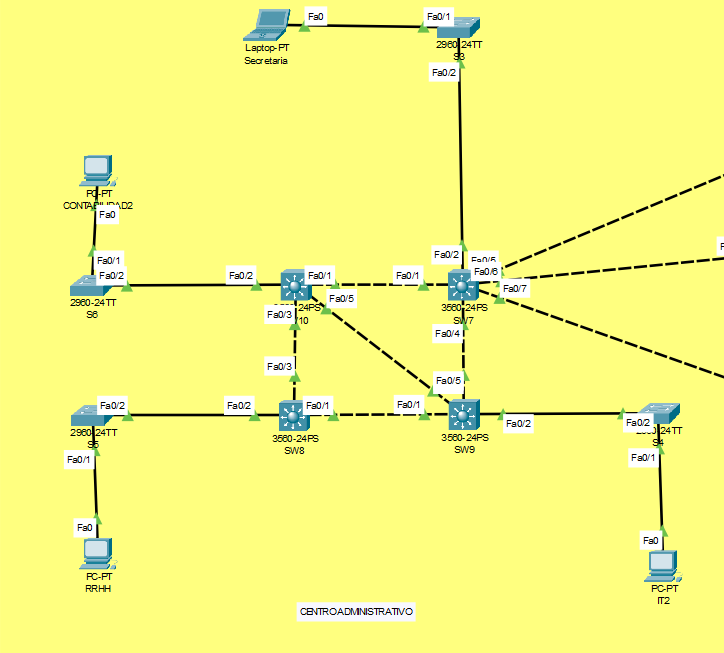

### Área de trabajo
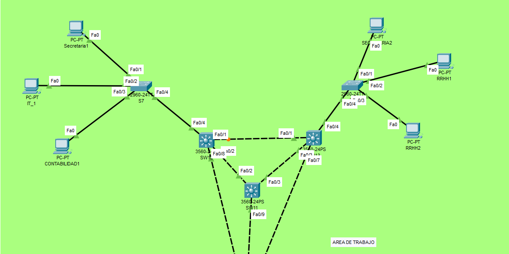

### BackBone
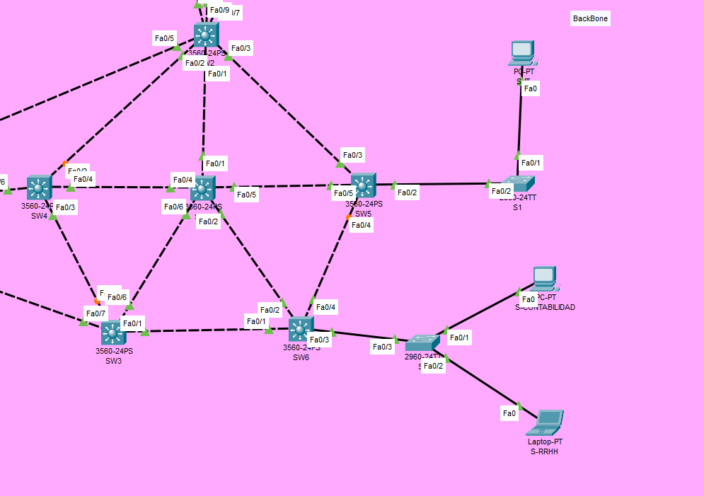

## Configuración de las VTP
### Comandos utilizados
- enable
- configure terminal
- vtp mode <server | transparent | client>
- vtp domain P11
- vtp password usac
- vtp version 2
- exit
- wr

Para verificar la configuración en el switch se deberá ingresar el siguiente comando:
- show vtp status

### BackBone

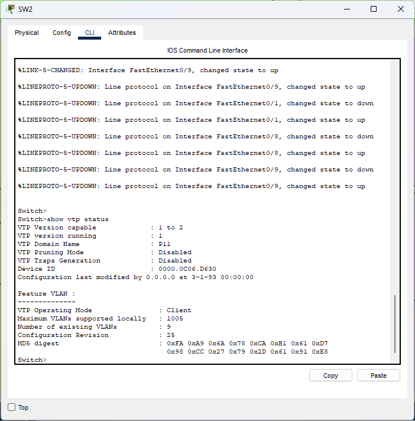

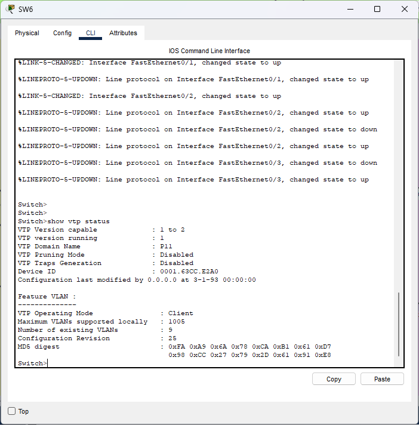
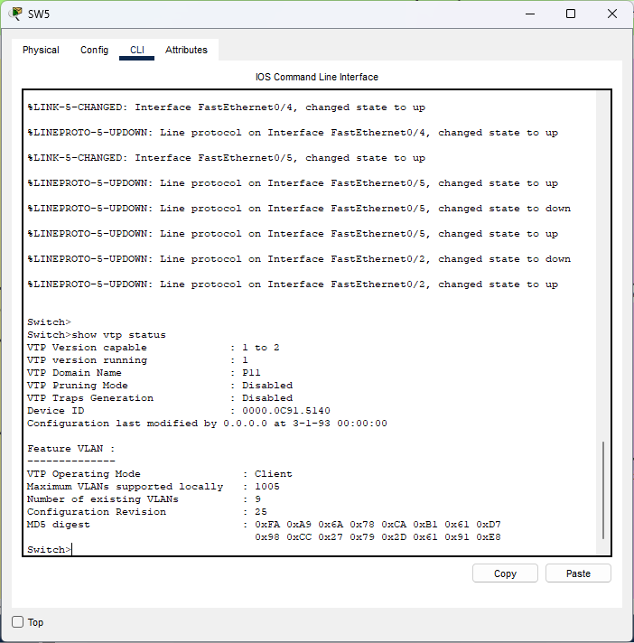

### Centro administrativo

### Área de trabajo

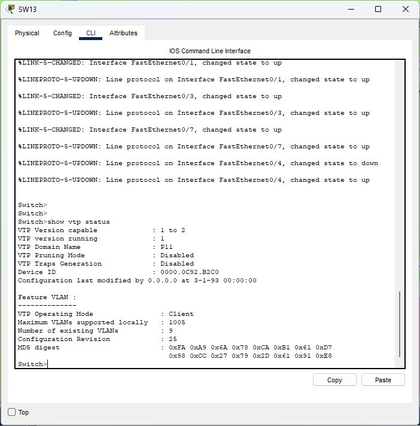

## Modo troncal
### Comandos utilizados
- enable
- configure terminal
- interface range f0/1-2 para este ejemplo
- switchport trunk encapsulation dot1q
- switchport mode trunk
- switchport trunk allowed vlan all
- exit
- exit
- wr

Para verificar la configuración en el switch se deberá ingresar el siguiente comando:
- show startup-config

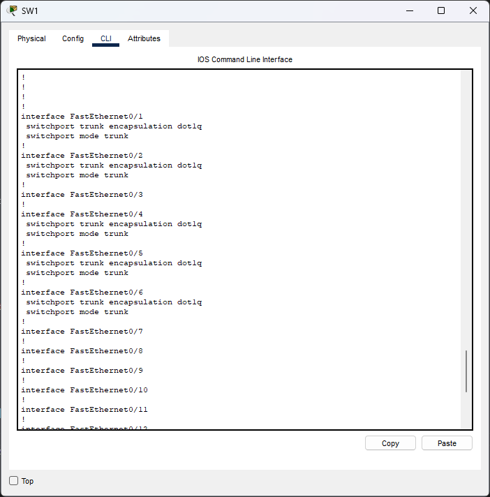
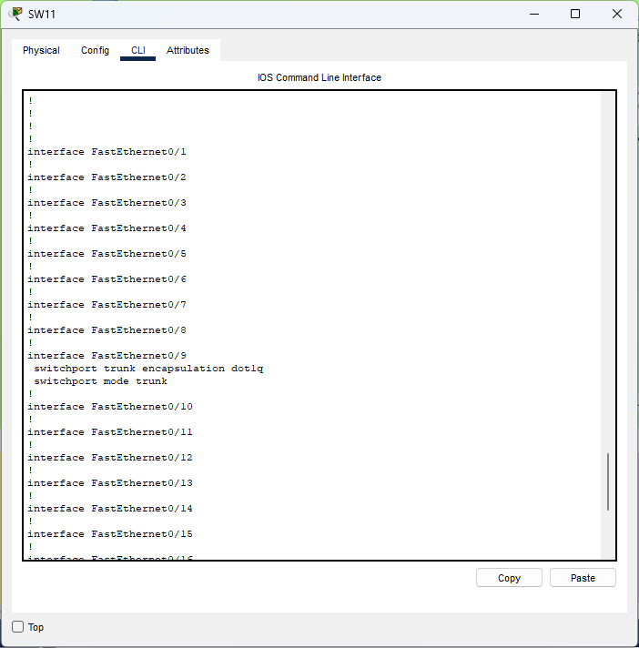

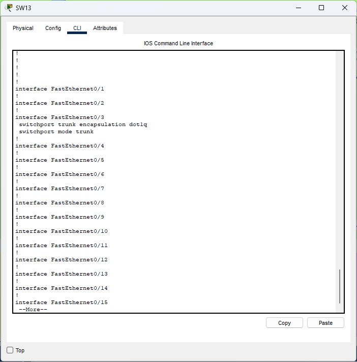

## Configuración de las VLAN
### Comandos utilizados
- enable
- configure terminal
- vlan <26 | 36 | 46 | 56>
- name <contabilidad | secretaria | RRHH | IT>
- exit

repetir el proceso con cada una de las VLAN
- exit
- exit
- wr

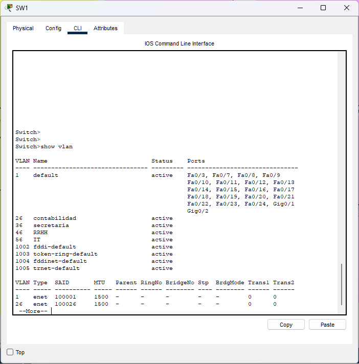

## Ping entre áreas
- Ping entre RRHH

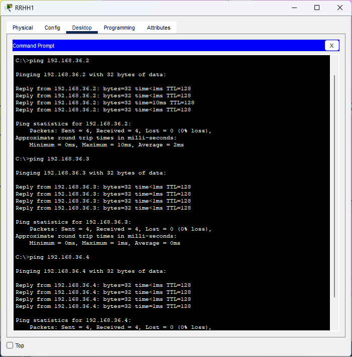

- Ping entre secretaría

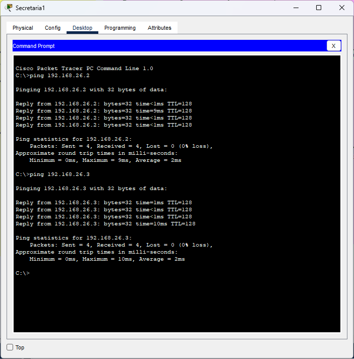

- Ping entre contabilidad

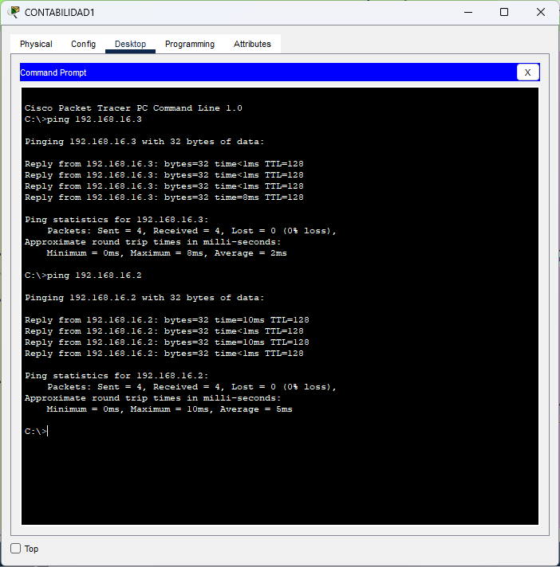

- Ping entre IT