# Manual técnico
## Introducción
En la implementación de las redes para las empresas anteriores, su
reputación siguió creciendo, después de unos días surgió una nueva oportunidad, una
reconocida empresa de venta de línea de dispositivos electrónicos lo contrató para que
trabaje en su red regional, interconectando de momento varias sedes hacia la sede central
en la ciudad capital con posibilidad de expansión.

## Topología de red

### Sede Jutiapa
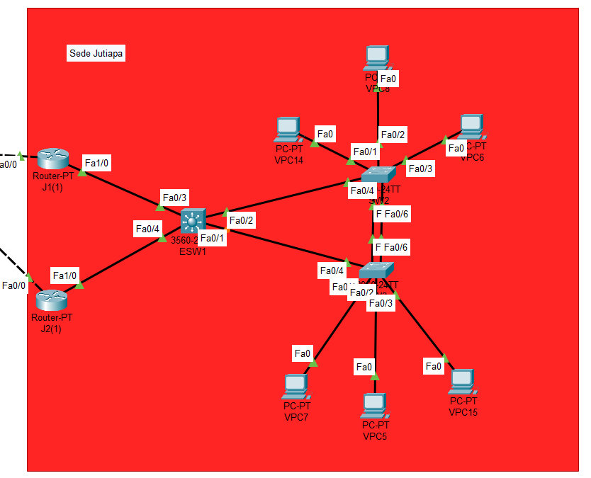

### Sede Escuintla
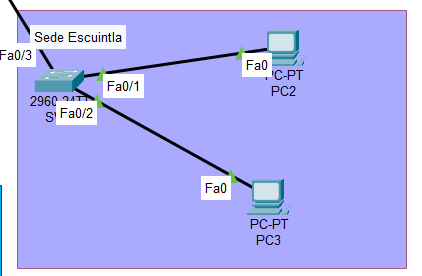

### Sede Izabal
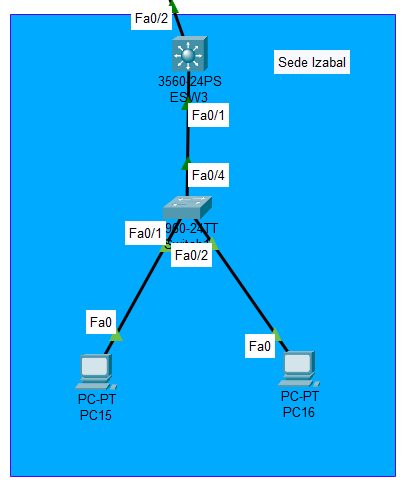

### Sede Peten
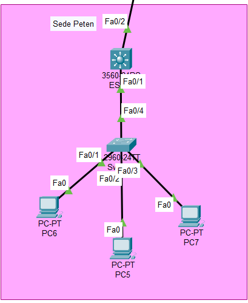

### Sede Quiche
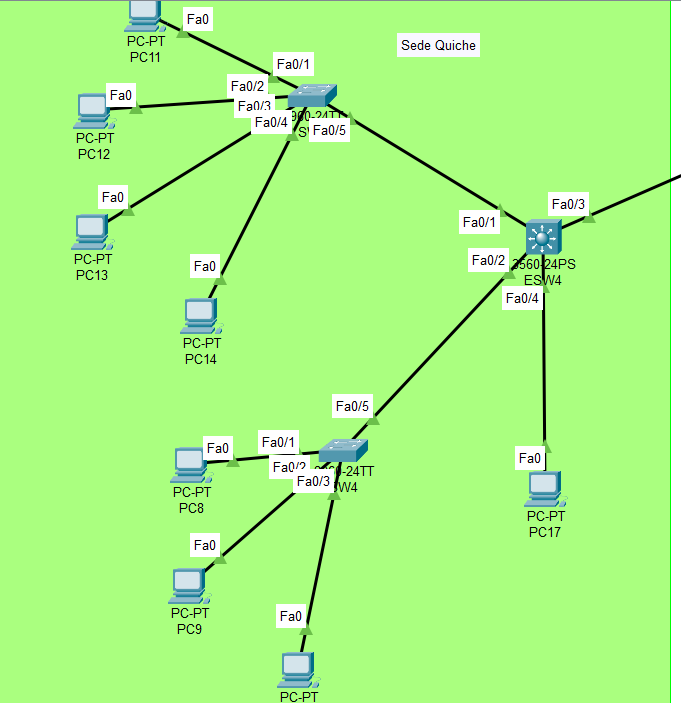

### CORE
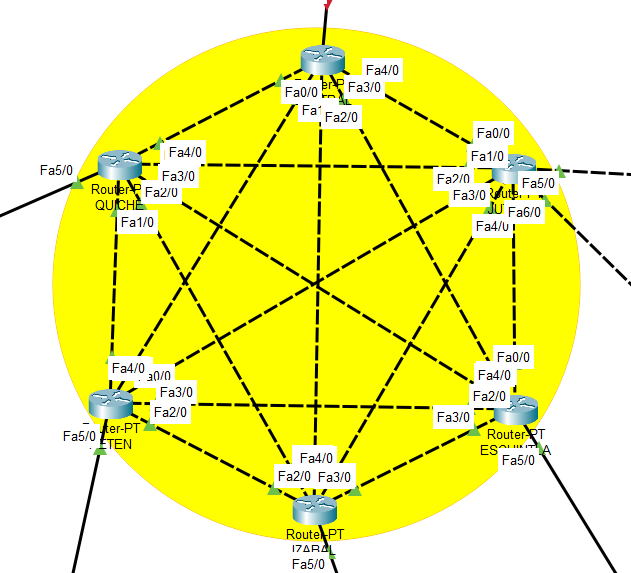

### FIREWALL
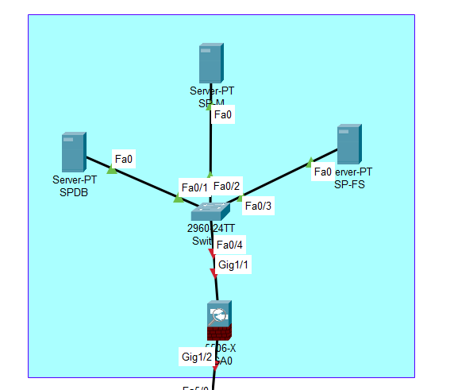

## Configuraciónes por SEDES

## SEDE JUTIAPA 
### Comandos utilizados

## Activacion de Modos
- enable
- configure terminal
- vtp mode <server | client>
- vtp domain P11
- vtp password usac
- vtp version 2
- exit
- wr

Para verificar la configuración en el switch se deberá ingresar el siguiente comando:
- show vtp status

### Imagen VTP
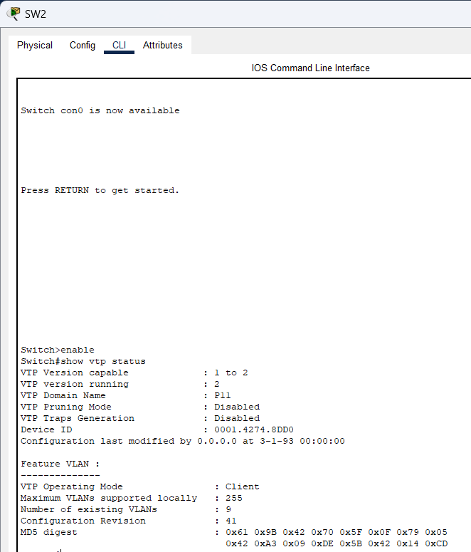

## Modo troncal
- enable
- configure terminal
- interface range f0/1-2 para este ejemplo
- switchport trunk encapsulation dot1q
- switchport mode trunk
- switchport trunk allowed vlan all
- exit
- exit
- wr

Para verificar la configuración en el switch se deberá ingresar el siguiente comando:
- show startup-config

### Imagen Interfaces
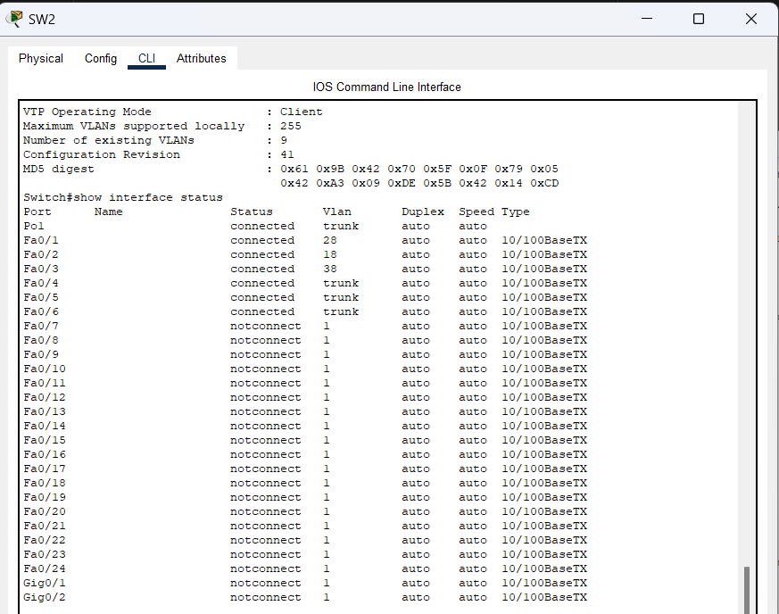

## Configuración de las VLAN
### Comandos utilizados
- enable
- configure terminal
- vlan <18 | 28 | 38 | 48>
- name <RRHH | CONTABILIDAD | VENTAS | INFORMATICA>
- exit

repetir el proceso con cada una de las VLAN
- exit
- exit
- wr

### Imagen Vlan 
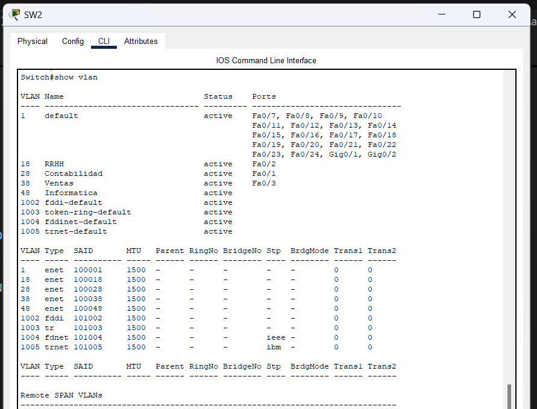

## SEDE Escuintla
### Comandos utilizados

## Activacion de Modos
- enable
- configure terminal
- vtp mode <server | client>
- vtp domain P11
- vtp password usac
- vtp version 2
- exit
- wr

Para verificar la configuración en el switch se deberá ingresar el siguiente comando:
- show vtp status

### Imagen VTP
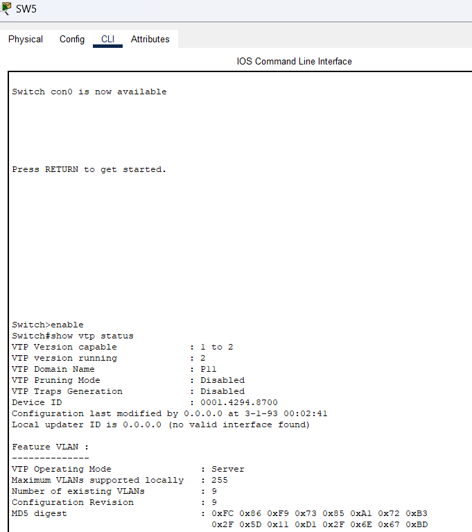

## Modo troncal
- enable
- configure terminal
- interface range f0/1-2 para este ejemplo
- switchport trunk encapsulation dot1q
- switchport mode trunk
- switchport trunk allowed vlan all
- exit
- exit
- wr

Para verificar la configuración en el switch se deberá ingresar el siguiente comando:
- show startup-config

### Imagen Interfaces
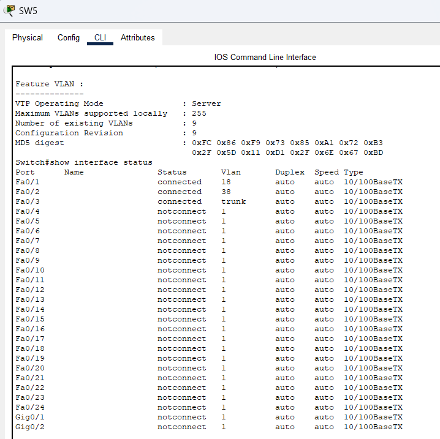

## Configuración de las VLAN
### Comandos utilizados
- enable
- configure terminal
- vlan <18 | 28 | 38 | 48>
- name <RRHH | CONTABILIDAD | VENTAS | INFORMATICA>
- exit

repetir el proceso con cada una de las VLAN
- exit
- exit
- wr

### Imagen Vlan 
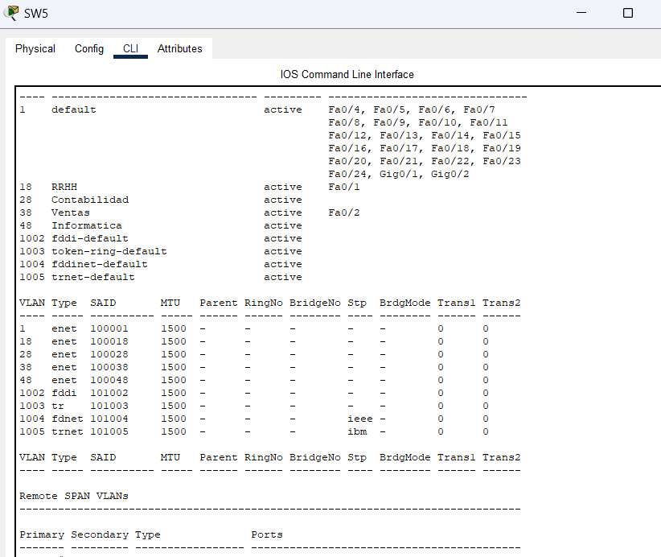

## SEDE IZABAL
### Comandos utilizados

## Activacion de Modos
- enable
- configure terminal
- vtp mode <server | client>
- vtp domain P11
- vtp password usac
- vtp version 2
- exit
- wr

Para verificar la configuración en el switch se deberá ingresar el siguiente comando:
- show vtp status

### Imagen VTP
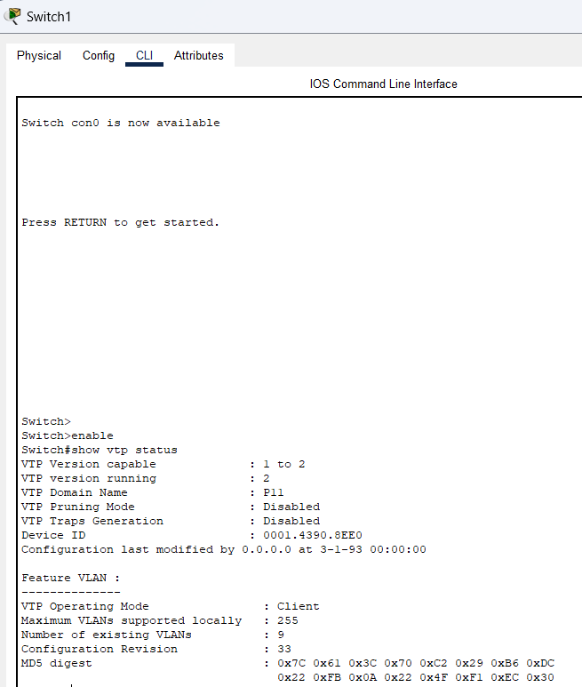

## Modo troncal
- enable
- configure terminal
- interface range f0/1-2 para este ejemplo
- switchport trunk encapsulation dot1q
- switchport mode trunk
- switchport trunk allowed vlan all
- exit
- exit
- wr

Para verificar la configuración en el switch se deberá ingresar el siguiente comando:
- show startup-config

### Imagen Interfaces
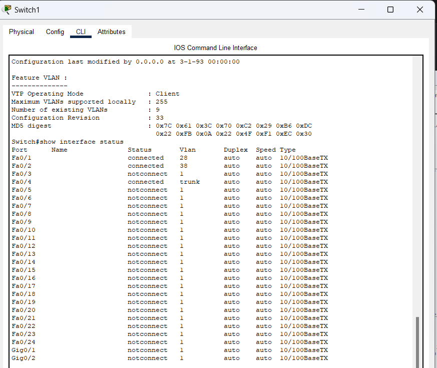

## Configuración de las VLAN
### Comandos utilizados
- enable
- configure terminal
- vlan <18 | 28 | 38 | 48>
- name <RRHH | CONTABILIDAD | VENTAS | INFORMATICA>
- exit

repetir el proceso con cada una de las VLAN
- exit
- exit
- wr

### Imagen Vlan 
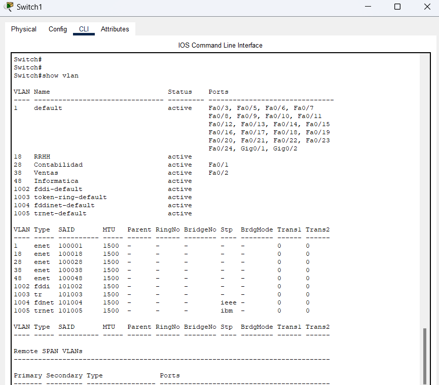

## SEDE PETEN
### Comandos utilizados

## Activacion de Modos
- enable
- configure terminal
- vtp mode <server | client>
- vtp domain P11
- vtp password usac
- vtp version 2
- exit
- wr

Para verificar la configuración en el switch se deberá ingresar el siguiente comando:
- show vtp status

### Imagen VTP
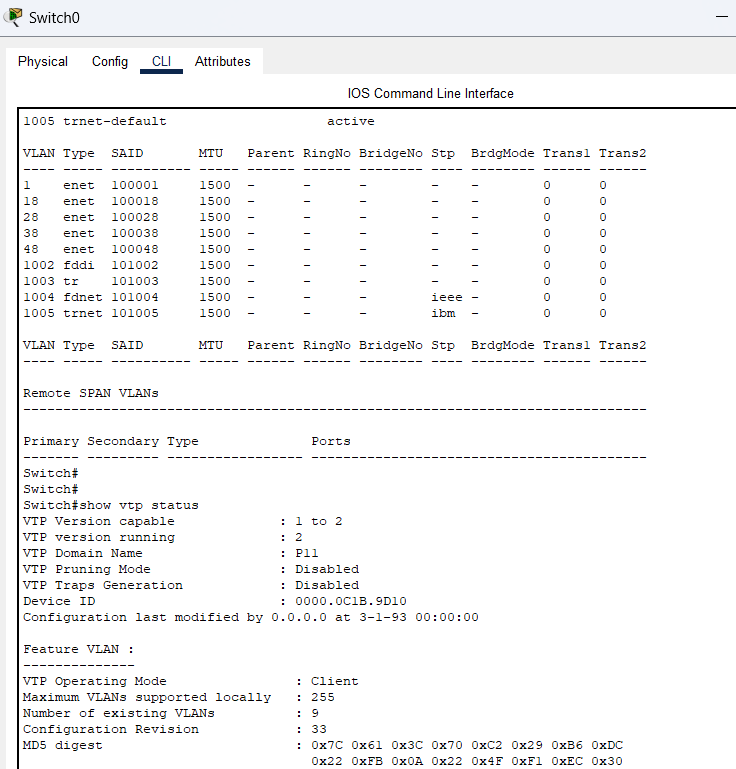

## Modo troncal
- enable
- configure terminal
- interface range f0/1-2 para este ejemplo
- switchport trunk encapsulation dot1q
- switchport mode trunk
- switchport trunk allowed vlan all
- exit
- exit
- wr

Para verificar la configuración en el switch se deberá ingresar el siguiente comando:
- show startup-config

### Imagen Interfaces
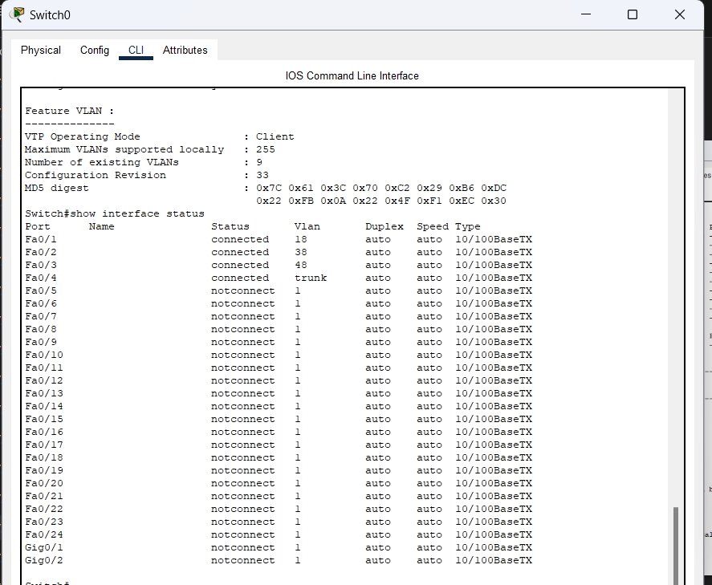

## Configuración de las VLAN
### Comandos utilizados
- enable
- configure terminal
- vlan <18 | 28 | 38 | 48>
- name <RRHH | CONTABILIDAD | VENTAS | INFORMATICA>
- exit

repetir el proceso con cada una de las VLAN
- exit
- exit
- wr

### Imagen Vlan 
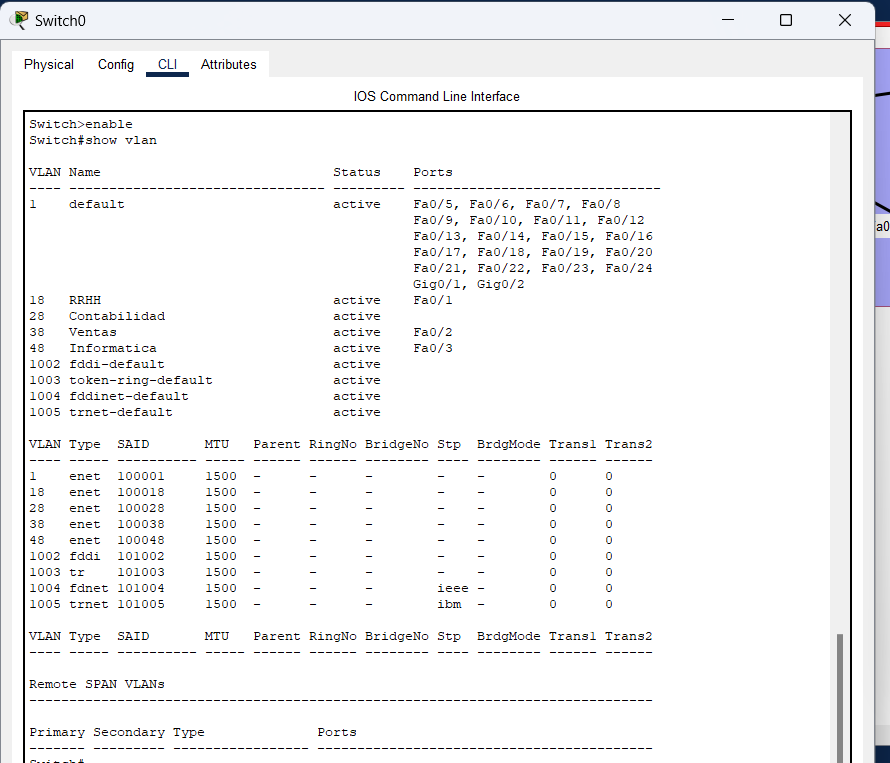

## SEDE QUICHE
### Comandos utilizados

## Activacion de Modos
- enable
- configure terminal
- vtp mode <server | client>
- vtp domain P11
- vtp password usac
- vtp version 2
- exit
- wr

Para verificar la configuración en el switch se deberá ingresar el siguiente comando:
- show vtp status

### Imagen VTP
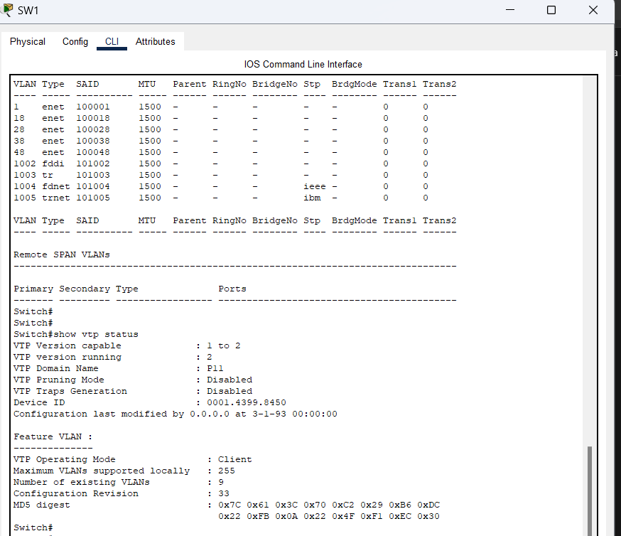

## Modo troncal
- enable
- configure terminal
- interface range f0/1-2 para este ejemplo
- switchport trunk encapsulation dot1q
- switchport mode trunk
- switchport trunk allowed vlan all
- exit
- exit
- wr

Para verificar la configuración en el switch se deberá ingresar el siguiente comando:
- show startup-config

### Imagen Interfaces
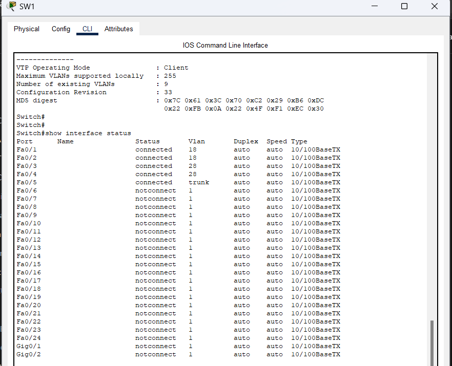

## Configuración de las VLAN
### Comandos utilizados
- enable
- configure terminal
- vlan <18 | 28 | 38 | 48>
- name <RRHH | CONTABILIDAD | VENTAS | INFORMATICA>
- exit

repetir el proceso con cada una de las VLAN
- exit
- exit
- wr

### Imagen Vlan 
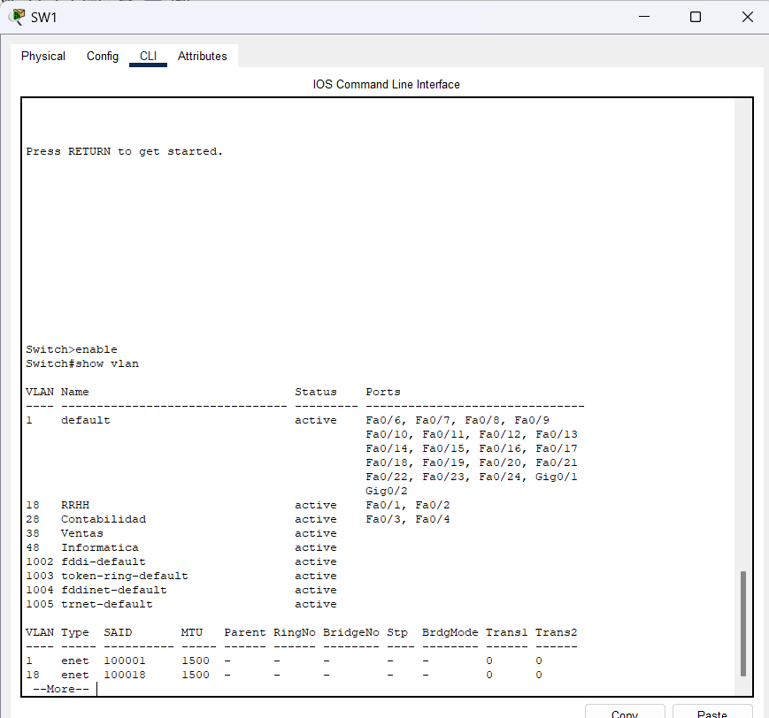

## CORE
### Comandos utilizados

### OSPF
- enable
- configure terminal
- router ospf 1
- network 10.0.0.0 0.0.0.3 area 0
- network 10.0.0.4 0.0.0.3 area 0
- network 10.0.0.8 0.0.0.3 area 0
- network 10.0.0.12 0.0.0.3 area 0
- network 10.0.0.16 0.0.0.3 area 0
- exit
- exit
- wr

Se colocaron en los routers en la red correspondiente.

## EIGRP
- enable
- configure terminal
- router eigrp 1
- network 10.0.0.0 0.0.0.3
- network 10.0.0.20 0.0.0.3
- network 10.0.0.24 0.0.0.3
- network 10.0.0.28 0.0.0.3
- network 10.0.0.32 0.0.0.3
- no auto-summary
- exit
- exit
- wr

Se colocaron en los routers en la red correspondiente.

## RIP

- enable
- configure terminal
- router rip
- version 2
- network 10.0.0.0
- passive-interface default
- no passive-interface fa0/0
- no passive-interface fa1/0
- no passive-interface fa2/0
- no passive-interface fa3/0
- no passive-interface fa4/0
- exit
- exit
- wr

Se colocaron en los routers en la red correspondiente.

## ASIGNACION DE IP A LAS INTERFACES CORRESPONDIENTES DE CADA ROUTER

- enable
- configure terminal
- no ip domain-lookup
- hostname CENTRAL
- interface Fa0/0
- ip add 10.0.0.1 255.255.255.252
- no shutdown
- exit
- do w
- interface Fa1/0
- ip add 10.0.0.5 255.255.255.252
- no shutdown
- exit
- do w
- interface Fa2/0
- ip add 10.0.0.9 255.255.255.252
- no shutdown
- exit
- do w
- interface Fa3/0
- ip add 10.0.0.13 255.255.255.252
- no shutdown
- exit
- do w
- interface Fa4/0
- ip add 10.0.0.17 255.255.255.252
- no shutdown
- exit
- do w

